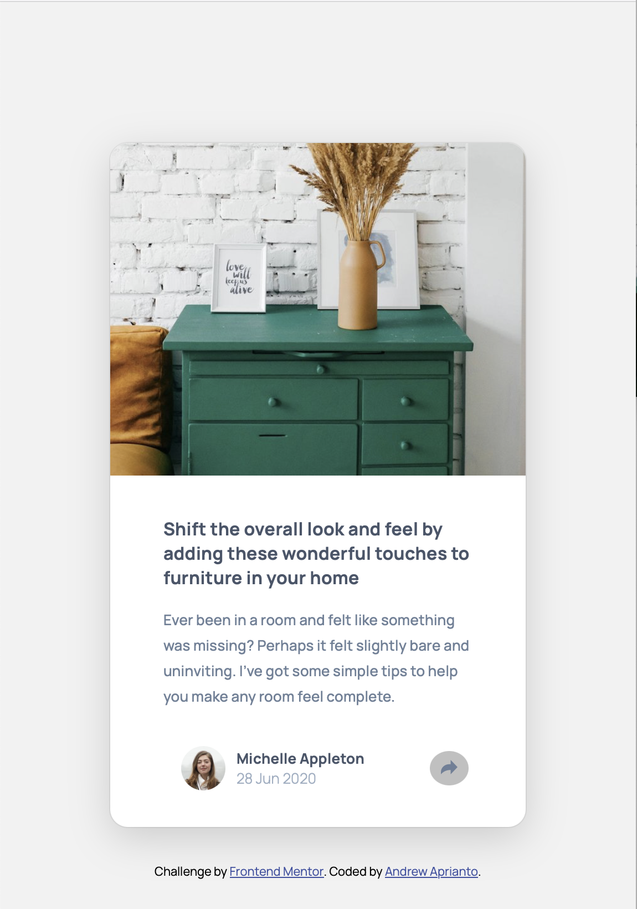

# Frontend Mentor - Article preview component solution

This is a solution to the [Article preview component challenge on Frontend Mentor](https://www.frontendmentor.io/challenges/article-preview-component-dYBN_pYFT). Frontend Mentor challenges help you improve your coding skills by building realistic projects.

## Table of contents

- [Overview](#overview)
  - [The challenge](#the-challenge)
  - [Screenshot](#screenshot)
  - [Links](#links)
- [My process](#my-process)
  - [Built with](#built-with)
  - [Continued development](#continued-development)
- [Author](#author)

## Overview

### The challenge

Users should be able to:

- View the optimal layout for the component depending on their device's screen size
- See the social media share links when they click the share icon

### Screenshot

Desktop

Mobile

### Links

- Solution URL: [Github](https://github.com/meandrewaprianto/Article-Preview)
- Live Site URL: [Vercel](https://article-preview-navy-seven.vercel.app)

## My process

### Built with

- Semantic HTML5 markup
- Flexbox
- CSS Grid
- Mobile-first workflow

### Continued development

Yes, Looking another solution for overlay social menu share button.

## Author

- Frontend Mentor - [@meandrewaprianto](https://www.frontendmentor.io/profile/meandrewaprianto)
